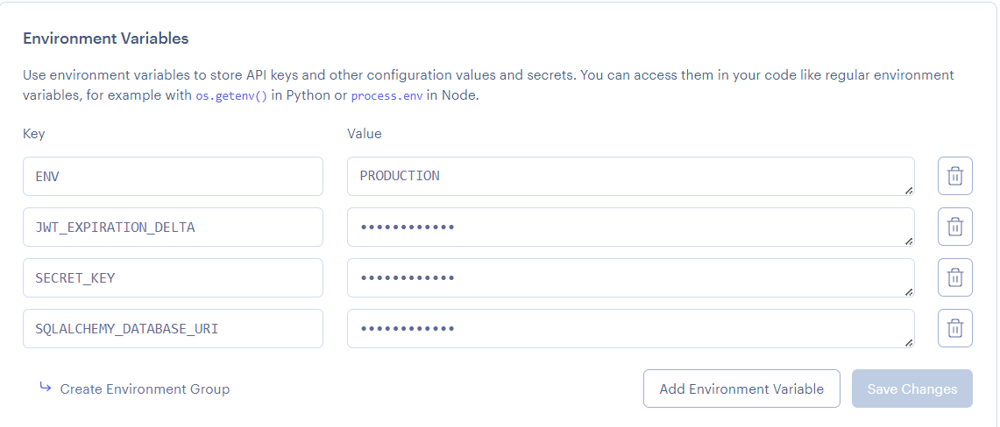
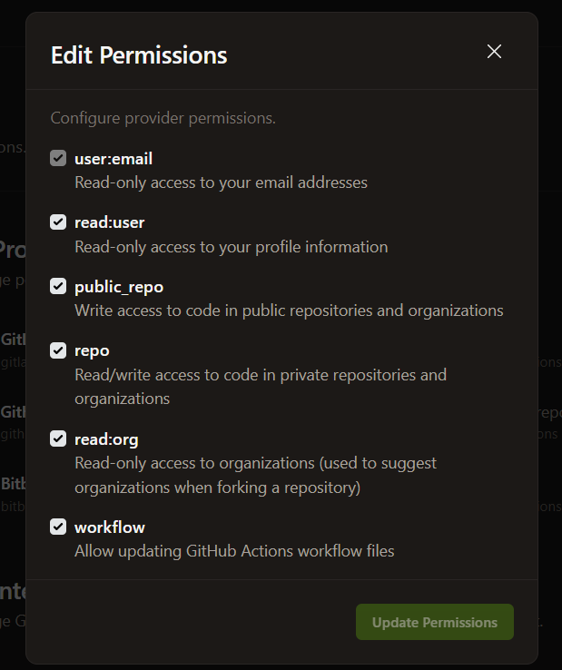

# iGOVTT Asset Tracking System (Based on Flask MVC)

[](https://gitpod.io/#https://github.com/AssetTrackingProjectATP/flaskmvc)
<a href="https://render.com/deploy?repo=https://github.com/AssetTrackingProjectATP/flaskmvc">
  
</a>


A web application for tracking assets, their locations, assignments, and audit history, built using Flask and structured with the Model-View-Controller (MVC) pattern. Originally based on the [Flask MVC Template](https://github.com/uwidcit/flaskmvc).

**Live Demo:** [Demo Site](https://asset-tracking-rzc0.onrender.com) (Note: May take a moment to spin up on Render's free tier)

**Postman Collection:** [View API Docs](https://documenter.getpostman.com/view/44230207/2sB2cd5e13)

## Features

*   **Asset Management:** Add, view, edit, and delete assets (laptops, projectors, etc.).
*   **Location Hierarchy:** Manage Buildings, Floors, and Rooms.
*   **User Authentication:** Secure login, password reset via email.
*   **Assignee Tracking:** Assign assets to individuals.
*   **Audit Trail:** Record asset scans and status changes (Good, Missing, Misplaced, Lost).
*   **Area Audit:** Perform audits using Manual Entry, Barcode, RFID (simulated), or QR Code scanning.
*   **Discrepancy Reporting:** View and manage assets that are Missing or Misplaced.
*   **CSV Import/Export:** Bulk import assets and locations; download report templates.
*   **Settings:** Manage user accounts, locations, and perform bulk operations.

## Project Structure

The project follows the MVC pattern:

*   `App/models/`: Defines the database schema (SQLAlchemy models).
*   `App/controllers/`: Contains the business logic interacting with models.
*   `App/views/`: Defines Flask blueprints and routes, handling requests and rendering templates.
*   `App/templates/`: HTML templates (Jinja2).
*   `App/static/`: Static files (CSS, JavaScript, Images).
*   `wsgi.py`: Application entry point and Flask CLI commands.
*   `requirements.txt`: Python dependencies.
*   `render.yaml`: Configuration for deployment on Render.
*   `.Dockerfile`: Configuration for building the Docker container.

## Dependencies

*   Python 3.9+ / pip3
*   Packages listed in `requirements.txt` (includes Flask, SQLAlchemy, JWT, Psycopg2, Gunicorn, etc.)
*   **System Dependencies (for `mysqlclient` build):** `libmysqlclient-dev` (Debian/Ubuntu) or equivalent MySQL/MariaDB development headers.

## Installation

1.  **Clone the repository:**
    ```bash
    git clone https://github.com/uwidcit/flaskmvc.git
    cd flaskmvc
    ```
2.  **Set up a virtual environment (recommended):**
    ```bash
    python -m venv venv
    source venv/bin/activate  # On Windows use `venv\Scripts\activate`
    ```
3.  **Install System Dependencies (if needed for `mysqlclient`):**
    *   If `pip install` later fails on `mysqlclient`, you might need development headers.
    *   **On Debian/Ubuntu:**
        ```bash
        sudo apt update
        sudo apt install libmysqlclient-dev gcc pkg-config
        ```
    *   **On macOS (using Homebrew):**
        ```bash
        brew install mysql # Or mariadb
        # Ensure mysql_config is in your PATH or set environment variables
        ```
    *   **On other systems:** Install the appropriate MySQL or MariaDB development package.
4.  **Install Python dependencies:**
    ```bash
    pip install -r requirements.txt
    ```

## Configuration Management

Configuration (database URLs, secret keys, API keys, email credentials) is managed differently for development and production to avoid committing sensitive information.

### In Development (Local/Gitpod)

1.  **Database:** By default, the app uses a local SQLite database (`temp-database.db`) defined in `App/default_config.py`.
2.  **Secrets:** `SECRET_KEY` is set in `App/default_config.py`.
3.  **Email:** Mail settings (`MAIL_SERVER`, `MAIL_USERNAME`, `MAIL_PASSWORD`, etc.) can be set in `App/default_config.py` OR, more securely, in a `.flaskenv` file at the project root.
    *   **`.flaskenv` (Recommended for local secrets):** Create a file named `.flaskenv` in the project root (this file is usually ignored by git). Add variables like:
        ```dotenv
        FLASK_APP=wsgi.py
        FLASK_DEBUG=True
        SECRET_KEY='your_development_secret_key' # Override default if needed
        MAIL_SERVER=smtp.gmail.com
        MAIL_PORT=587
        MAIL_USE_TLS=True
        MAIL_USERNAME=your-dev-email@gmail.com
        MAIL_PASSWORD=your-gmail-app-password # Use App Passwords for Gmail
        MAIL_DEFAULT_SENDER='Your App Name <noreply@example.com>'
        # Add other ENV vars if needed
        ```
    *   Flask automatically loads variables from `.flaskenv`. **Do not commit `.flaskenv` if it contains secrets.**

The application loads configuration in this order (later steps override earlier ones):
1.  `App/default_config.py`
2.  `App/custom_config.py` (if it exists - useful for local overrides, usually gitignored)
3.  Environment variables (loaded via `.flaskenv` or system environment)
4.  Explicit Production Settings (see below)

### In Production (Render)

When deploying to Render (or similar platforms):

1.  **Database:** Render automatically provisions a PostgreSQL database and injects connection details (`POSTGRES_URL`, `POSTGRES_USER`, `POSTGRES_PASSWORD`, `POSTGRES_DB`) as environment variables. The `App/config.py` file detects the `ENV=production` variable and constructs the `SQLALCHEMY_DATABASE_URI` from these.
2.  **Secrets & Keys:** Set `SECRET_KEY`, `JWT_SECRET_KEY` (if used separately), and any other API keys as **Environment Variables** in your Render service dashboard under the "Environment" tab.
3.  **Email:** Configure `MAIL_USERNAME`, `MAIL_PASSWORD`, etc., as Environment Variables in Render.
4.  **Set `ENV=production`:** Ensure this environment variable is set in Render. This is crucial for using the production database and other settings. The `render.yaml` file sets this.



## Flask Commands (`wsgi.py`)

Use Flask's CLI for various tasks. Define custom commands in `wsgi.py`.

**Example: Create a User**

1.  Command definition in `wsgi.py`:
    ```python
    # inside wsgi.py
    user_cli = AppGroup('user', help='User object commands')

    @user_cli.command("create")
    @click.argument("email") # Added email
    @click.argument("username")
    @click.argument("password")
    def create_user_command(email, username, password):
        user = create_user(email, username, password) # Updated controller function likely takes email
        if user:
            print(f'User {username} ({email}) created!')
        else:
            print(f'User creation failed (email might exist).')

    app.cli.add_command(user_cli) # add the group to the cli
    ```
2.  Execute from the terminal:
    ```bash
    flask user create newuser@example.com newusername newpassword
    ```

**Other built-in/custom commands:**

*   `flask init`: Initialize the database (drops existing tables, creates schema, adds default data).
*   `flask db init`: (Run once) Initialize Flask-Migrate.
*   `flask db migrate -m "Description"`: Create a new database migration script after changing models.
*   `flask db upgrade`: Apply pending migrations to the database.
*   `flask run`: Run the development server.
*   `flask test user`: Run user-related tests (example).
*   `flask test`: Run all tests using pytest.

## Running the Project

*   **Development:**
    ```bash
    flask run
    # Access at http://127.0.0.1:8080 (or the port specified)
    ```
    *(Flask uses the settings from `.flaskenv` or defaults)*

*   **Production (using Gunicorn):**
    ```bash
    gunicorn -c gunicorn_config.py wsgi:app
    ```
    *(This is typically executed by the production server, e.g., Render)*

## Deploying to Render

1.  **Click the "Deploy to Render" button:** [](https://render.com/deploy?repo=https://github.com/AssetTrackingProjectATP/flaskmvc)
2.  **Or Create Manually:** Create a new "Web Service" on Render, connect your GitHub repository.
3.  **Build & Start:** Render uses `render.yaml` to determine build (`pip install -r requirements.txt`) and start (`gunicorn wsgi:app`) commands.
4.  **Environment Variables:** Configure necessary environment variables (like `SECRET_KEY`, `MAIL_PASSWORD`, etc.) in the Render dashboard. The database variables and `ENV=production` are usually set by `render.yaml`.
5.  **Database Initialization:** After the first deploy, you *must* initialize the database. Go to your service on Render, open the "Shell" tab, and run:
    ```bash
    flask init
    ```
6.  **Migrations:** If you deploy model changes, run migrations via the Render Shell:
    ```bash
    flask db upgrade
    ```

## Initializing the Database

When setting up the project for the first time locally or after deploying to a new production environment with an empty database:

1.  Ensure database configuration is correct (SQLite for local default, or ENV VARS for Render/production).
2.  Run the initialization command:
    ```bash
    flask init
    ```
    This command (defined in `wsgi.py`) will:
    *   Drop all existing tables.
    *   Create all tables based on the models.
    *   Add default data (e.g., admin user, default Building/Floor, 'UNKNOWN' Room).

## Database Migrations

When you modify your SQLAlchemy models (`App/models/*.py`):

1.  **Generate Migration Script:**
    ```bash
    flask db migrate -m "Brief description of changes"
    ```
    *(This creates a script in the `migrations/versions/` directory)*
2.  **Review the Script:** Check the generated script to ensure it correctly reflects your changes.
3.  **Apply Migration:**
    ```bash
    flask db upgrade
    ```
    *(This applies the changes to your database)*

*   Use `flask db --help` for more options.
*   More info: [Flask-Migrate Documentation](https://flask-migrate.readthedocs.io/en/latest/)

## CSV Import

The application supports bulk importing of assets and locations via CSV files in the Settings page.

*   **Asset CSV:** Upload a CSV with asset details. Columns typically include `Item`, `Asset Tag`, `Brand`, `Model`, `Serial Number`, `Location` (Room ID or Name), `Condition`, `Assignee` (Assignee ID or Name).
*   **Location CSV:** Upload a CSV defining the location hierarchy. Columns include `building_id`, `building_name`, `floor_id`, `floor_name`, `room_id`, `room_name`. IDs are optional; if omitted, they will be generated. The system attempts to match existing locations by name/ID before creating new ones.

Downloadable templates are available in the Settings page via the `/api/download/asset-template` and `/api/download/location-template` endpoints.

## Testing

Unit and Integration tests are located in `App/tests/`. Pytest is used as the test runner.

*   **Run all tests:**
    ```bash
    pytest
    # or
    flask test
    ```
*   **Run specific tests (e.g., user tests):**
    ```bash
    flask test user
    # Run only unit tests for user
    flask test user unit
    # Run only integration tests for user
    flask test user int
    ```
    *(Requires corresponding commands defined in `wsgi.py`)*

### Test Coverage

Generate test coverage reports:

*   **Console Report:**
    ```bash
    coverage report
    ```
*   **HTML Report (in `htmlcov/` directory):**
    ```bash
    coverage html
    ```

## Troubleshooting

*   **`pip install` Fails (Development):** If `pip install -r requirements.txt` fails, particularly on the `mysqlclient` package, you may need to install system-level development headers.
    *   **On Debian/Ubuntu:**
        ```bash
        sudo apt update
        sudo apt install libmysqlclient-dev gcc pkg-config
        ```
    *   **On macOS (Homebrew):**
        ```bash
        brew install mysql # or mariadb
        ```
    *   After installing system dependencies, try `pip install -r requirements.txt` again.
*   **Views returning 404:** Ensure the view blueprint (e.g., `user_views`) is imported in `App/views/__init__.py` and added to the `views` list.
*   **Cannot Update Workflow file in Gitpod:** Check your Gitpod GitHub integration permissions. Ensure "workflow" scope is enabled: [Gitpod Integrations](https://gitpod.io/integrations). 
*   **Database Issues (Local):**
    *   If you added/changed models, run `flask db migrate` and `flask db upgrade`.
    *   For a complete reset (local dev only!), delete the `temp-database.db` file and run `flask init`.
*   **Deployment Issues (Render):**
    *   Check the "Events" and "Logs" tabs in your Render service dashboard for errors.
    *   Verify all necessary Environment Variables are set correctly in Render.
    *   Ensure `flask init` (and `flask db upgrade` if needed) was run via the Render Shell after deployment.
*   **Configuration Errors:** Double-check environment variable names and values, especially for the database connection and secret keys. Ensure `ENV=production` is set for production deployments.
*   **Email Not Sending:** Verify `MAIL_*` environment variables are correct. Check your email provider's security settings (e.g., Gmail App Passwords). Look for errors in application logs.

## Contributing

Contributions are welcome! Please follow standard Gitflow practices.

## Group Members

*   Analisa Mohamed (816034646)
*   Phineas Munroe (816038061)
*   Lorenzo Gould-Davies (816033593)
